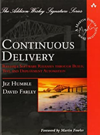

# Bonjour, je m'appelle Christophe Galon

---

Je suis actuellement ingénieur logiciel chez Pôle emploi à Bordeaux, France.

J'aide les équipes à se transformer pour adopter les pratiques liées au Continuous Delivery et au Software Craftmanship.

Je suis également très intéressé par la diffusion des connaissances et la living documentation.

# Conférence

Voici la vidéo d'une conférence donnée avec mes collègues Jérome et Rodrigo à Agile Tour Bordeaux en 2022.
Le sujet est un retour d'expérience sur la manière d'aider les équipes à se transformer durablement pour faire du Continuous Delivery.

Nous avons également donnée cette conférence à Agile Tour Toulouse et Agile Tour Aix-Marseille en 2022.

## Un peu de technique

Les principaux sujets techniques sur lesquels je travaille.

## Quelques lectures intéressantes

Une liste de livres qui m'ont particulièrement intéressés.

|  |  |  |  |
|--|--|--|--|
| **[Continuous Delivery](https://www.amazon.fr/Continuous-Delivery-Reliable-Deployment-Automation/dp/0321601912)** | **[Accelerate](https://www.amazon.fr/Accelerate-Building-Performing-Technology-Organizations/dp/1942788339)**  | **[Living documentation](https://www.amazon.fr/Living-Documentation-Cyrille-Martraire/dp/0134689321)**  | **[Le projet Unicorn](https://www.amazon.fr/projet-Unicorn-histoire-d%C3%A9veloppeurs-disruption/dp/2889153622)**  |

## Stats Github

Plusieurs tests en cours. Avec des stats différentes suivant l'outil utilisé...

### Une première version

Utilise un workflow GitHub. Généré tous les jours.

 
 

## Deuxième version

Sans génération préalable. Utilise des API en ligne.

### Mes repos les plus utilisés

