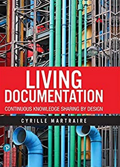

### Salut, Je m'appelle Christophe

---

Actuellement je suis Ingénieur Logiciel à Pôle emploi à Bordeaux, France.

J'aide les équipes à se transformer pour adopter les pratiques liées au Continuous Delivery et au Software Craftmanship.

Je suis également très intéressé par la diffusion des connaissances et la living documentation.

### Un peu de technique

### Quelques lectures intéressantes

Une liste de livres qui m'ont particulièrement intéressés.

|  |  |  |  |
|--|--|--|--|
| **[Continuous Delivery](https://www.amazon.fr/Continuous-Delivery-Reliable-Deployment-Automation/dp/0321601912)** | **[Accelerate](https://www.amazon.fr/Accelerate-Building-Performing-Technology-Organizations/dp/1942788339)**  | **[Living documentation](https://www.amazon.fr/Living-Documentation-Cyrille-Martraire/dp/0134689321)**  | **[Le projet Unicorn](https://www.amazon.fr/projet-Unicorn-histoire-d%C3%A9veloppeurs-disruption/dp/2889153622)**  |

### Stats Github

Oui, je commence...

